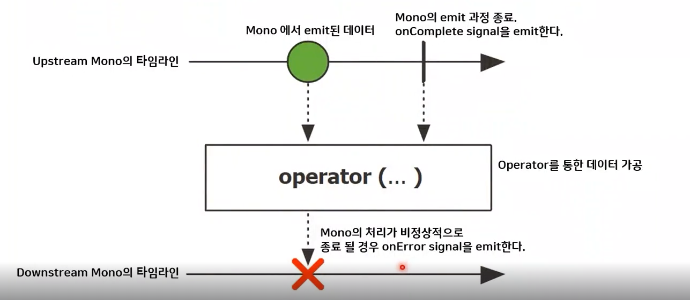
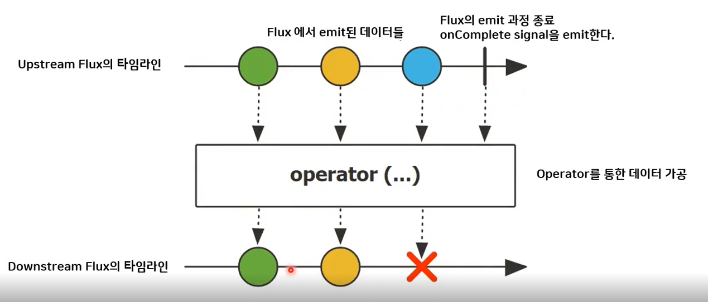

## Reactor란?

- Reactor 타입
    - 생산자
        - Mono ⇒ 데이터를 **0건 or 1건**만 보낼 수 있는 타입
        - Flux ⇒ 데이터를 **N건** 이상 보낼 수 있는 타입
    - 시퀀스
        - 데이터를 소비할 수 있도록 정의
        - just ⇒ 데이터 생성 연산자
            - ex). Flux.just(”문자열1”, “문자열2”);
    - 소비자 (구독자)
        - subscribe()

 

## Reactor 용어

- Publisher ⇒ **발행자**, 게시자, 생산자, 방출자
- Subscriber ⇒ **구독자**, 소비자
- Emit ⇒ Publisher가 **데이터를 내보내는 것**
- Sequence ⇒ **Publisher가 emit하는 데이터의 연속적인 흐름**을 정의 Operator 체인 형태로 정의
- Subscribe ⇒ **Subscriber가 Sequence를 구독**
- Dispose ⇒ **Subscriber가 Sequence 구독을 해지**
- Operator ⇒ **Reactor의 연산자**

 

---

 

## Mono란?

- 0개 or 1개 의 데이터를 Emit하는 Publisher
- 데이터 emit과정에서 에러가 발생하면 onError signal을 emit
    - onError signal ⇒ 에러가 발생했을 때 error 이벤트의 호출

### 마블 다이어그램

---

## Flux란?

- 0개 ~ N개 데이터를 emit하는 Publisher
- 데이터 emit과정에서 에러가 발생하면 onError signal을 emit
    - onError signal ⇒ 에러가 발생했을 때 error 이벤트의 호출

### 마블 다이어그램

---

 

